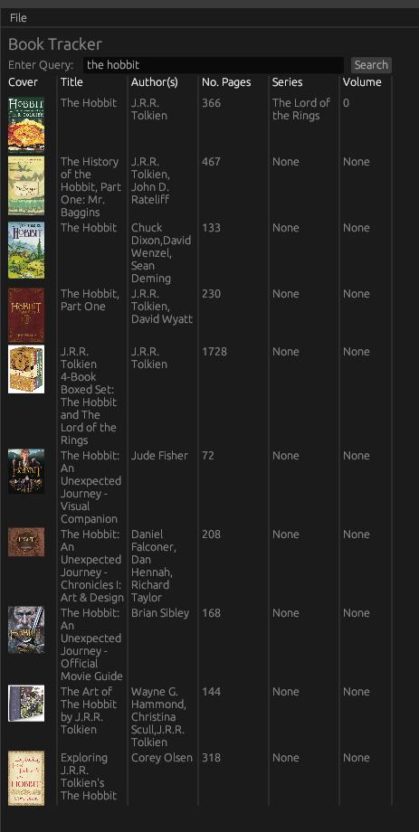

# Book Tracker
A personal application that combines my love for books with my passion for Rust programming. 

# Feature Overview
- [x] Integrate Goodreads web scraper to query for books online and gain metadata like number of pages, author(s), book series, ...
- [x] Create SQL database to keep track of reading progress
- [ ] Create GUI application to
  - [ ] Add new books
  - [ ] Update progress
  - [ ] View data about reading progress

# Screenshots

Sample search results from the query "the hobbit".

# Database
The database is using postgres, and the schema currently looks as follows: A table `owned_books` is used to store all books in my possession, including a unique ID, a title, a number of pages, the date it was acquired, a URL for its Goodreads page as well as its cover image URL. The book ID column is a primary.

A table `read_books` just contains a list of books I've read, using the ID column as a foreign key. The table includes a start and end date, and it has a check to ensure that the end date is *after* the start date. When a book is deleted from `owned_books`, it's deleted from this table too. This table can have the same book listed multiple times to support rereads.

The `authors` table contains a unique author ID and their name. 

The table `book_authors` is used as a map between book IDs and author IDs. This is necessary because books sometimes have more than one author, which would break a table if the information about the book itself (e.g., the `owned_books` table) would try to also list the author(s). This way, the schema keeps atomic integrity.

The `series_info` table does a similar cross-reference between books and book series. Again, a book might belong to more than one series, in which case we need this extra table for integrity. The table contains columns for the book ID, the series name, as well as the volume in the series. 

Finally, a `did_not_finish_books` table is intended to be used for books I didn't finish reading. It is simply a list of book IDs.

## Schema Design
There are a few things I need to adjust in the schema:
- [ ] Look into migrations
- [ ] In `authors`, split first and last name for cleaner sorting etc.
- [ ] Think about the ramifications of all the `ON DELETE CASCADE` definitions
- [ ] In `sqlx`, adjust functions to either generate objects of table rows automatically or replace `query!()` with `query_as!()`
